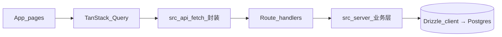

# AGENTS.md — Noticount 代码库指南

给仓库内 AI 助手和贡献者。以 **ESLint 配置** + **现有代码** 为准；本文档讲架构和习惯，避免和 [eslint.config.mjs](eslint.config.mjs) 打架。

## 项目简介

**Noticount**：自托管、**多币种**前端记账（见 [README.md](README.md)）。技术栈：

- **Next.js**（App Router，`next dev --turbopack`）
- **React**、**TypeScript**
- **Tailwind CSS**、**shadcn/ui**（Radix 等，位于 `components/ui/`）
- **Supabase**（仅 Auth）
- **TanStack Query**（服务端状态 + 缓存）
- **Zod**、**@t3-oss/env-nextjs**（环境变量校验）
- **Drizzle ORM** + `postgres` 直连 Postgres（数据访问）
- **@supabase/ssr**（服务端 cookie auth client）

包管理器：**pnpm**（`package.json` 里给 `@types/react` / `@types/react-dom` 配了 `pnpm.overrides`）。

## 常用命令

| 命令              | 说明                                          |
| ----------------- | --------------------------------------------- |
| `pnpm dev`        | 本地开发（Turbopack）                          |
| `pnpm build`      | 生产构建                                      |
| `pnpm start`      | 启动生产服务                                  |
| `pnpm lint`       | ESLint 检查 + 格式规则                        |
| `pnpm lint:fix`   | 自动修复可修项                                |
| `pnpm db:generate`| 从 `src/db/schema.ts` 生成 Drizzle migration  |
| `pnpm db:migrate` | 应用 `drizzle/` 目录里的 migration             |
| `pnpm db:push`    | 把 schema 直接推到 Postgres（无 migration 文件）|
| `pnpm db:studio`  | 打开 Drizzle Studio                            |

仓库无独立 Prettier。格式化交给 **ESLint**（`@antfu/eslint-config` + `formatters: true` + `eslint-plugin-format`）。文档和风格冲突时，听 `pnpm lint`。

## 代码风格（与 ESLint 对齐）

写新代码按 [eslint.config.mjs](eslint.config.mjs)：

- **对象类型**：用 `type`，不用 `interface`（`ts/consistent-type-definitions`）。
- **尾随逗号**：**不用**（`trailingComma: "never"`）。
- **缩进**：2 空格；**字符串**：双引号；**语句**：分号。
- **文件名**：`kebab-case`（`unicorn/filename-case`）；`README.md`、`AGENTS.md` 例外。
- **`process.env`**：TS/TSX 禁止直接读（`node/no-process-env`）。唯一例外 **[`src/env.js`](src/env.js)**：集中定义 + 校验环境变量。
- 其他：`no-console` 是 **warn**；`perfectionist/sort-imports`、`sort-exports` 是 **warn**。

提交前跑 `pnpm lint` 或 `pnpm lint:fix`。

## 导入与路径

- **路径别名**：`@/*` 指向仓库根目录（见 [tsconfig.json](tsconfig.json)）。优先 `@/components/...`、`@/lib/...`、`@/src/...`，跟现有代码一致。
- **同目录类型/模块**：可用相对路径（例：`lib/supabase.ts` 里的 `./supabase.type`）。
- **不要求**导入路径写 `.ts` / `.tsx` 扩展名（按当前 Next/TS 习惯）。

## 目录约定

** 更新文件时务必同步本段 **

```
src/app/                 # App Router：页面与布局
  (index)/               # 路由组
    layout.tsx           # QueryClientProvider、AuthCheck、Navbar 等
    signin/page.tsx
    record/              # 记账
      layout.tsx         # 并行槽位：submit、usage、list
      @submit/page.tsx
      @usage/page.tsx
      @list/page.tsx
  api/                   # Next.js route handlers（数据访问唯一入口）
    auth/session/route.ts
    account-records/route.ts
    account-records/list/route.ts
    usage/route.ts
    user-budget-settings/route.ts
  _components/           # 如 auth-check、navbar、set-budget-trigger（非 route segment）
  _context/              # 如 auth-session-ctx
src/db/                  # Drizzle schema + 客户端
  schema.ts              # 所有表 + pgEnum 定义
  client.ts              # Lazy proxy 包 postgres 连接
src/server/              # 业务逻辑层；user-scoped 工厂 + Drizzle 查询
  _auth.ts               # 服务端 auth 快照（getAuthSnapshot / requireAuthSnapshot）
  _supabase.ts           # @supabase/ssr 服务端 cookie client
  dates.ts               # 日期 / 月份工具
  records.ts             # account_records 业务
  budget.ts              # user_budget_settings 业务
  usage.ts               # 月度汇总（聚合查询）
src/styles/              # 全局样式
src/api/                 # 浏览器侧 fetch 封装（只负责拼请求 + 类型）
components/ui/           # shadcn 风格 UI 组件（含 drawer）
lib/                     # supabase 浏览器客户端（auth only）
drizzle/                 # drizzle-kit 生成的 migration SQL
```

## 环境变量

- 业务代码用 **`import { env } from "@/src/env"`** 取已校验变量；不要在 TS/TSX 到处写 `process.env`。
- 定义 + 校验在 **[`src/env.js`](src/env.js)**（`createEnv` + Zod）；服务端变量和 `NEXT_PUBLIC_*` 客户端变量都在这声明。
- Drizzle 直连需要 **`POSTGRES_URL`** 或 **`POSTGRES_PRISMA_URL`**（两者择一）。Supabase 项目设置 → Database → Connection string 取值。
- **[`next.config.ts`](next.config.ts)** 里 `import "@/src/env.js"`，构建阶段就校验环境变量。

## 数据访问（Drizzle + route handler）

- **schema**：[`src/db/schema.ts`](src/db/schema.ts) 定义所有表 + `pgEnum`。改 schema 后跑 `pnpm db:generate` 出 migration。
- **客户端**：[`src/db/client.ts`](src/db/client.ts) 用 lazy Proxy 包 `drizzle(postgres(url), { schema })`；求值时不连，第一个查询时才握手。
- **业务层**：[`src/server/`](src/server/) 下每个文件以 `userId` 为第一个参数（"scoped factory"），所有跨表查询、月度汇总、user 隔离都在这里；route handler 不直接见到 `db`。
- **route handlers**：[`src/app/api/**/route.ts`](src/app/api/) 是数据访问唯一入口。每个 handler 调 `requireAuthSnapshot()` 拿当前用户，把 `user.userId` 传给业务层函数。
- **请求 schema 校验**：所有 POST/PUT 在 route handler 里走 Zod `safeParse`，无效入参直接 400。

数据流：



## 认证与客户端数据

- **服务端 auth**：[`src/server/_supabase.ts`](src/server/_supabase.ts) 用 `@supabase/ssr` `createServerClient` 接 `next/headers` 的 cookies。
- **auth 快照**：[`src/server/_auth.ts`](src/server/_auth.ts) 导出 `getAuthSnapshot()` / `requireAuthSnapshot()`，返回脱敏后的 `{ userId, email, userName, avatarUrl, provider }`。
- **客户端 session**：[`src/api/user.ts`](src/api/user.ts) 的 `useSession()` 通过 `/api/auth/session` 拉快照；5 秒轮询 + 窗口聚焦重拉。
- **[`src/app/_components/auth-check.tsx`](src/app/_components/auth-check.tsx)**：用 `useSession()`；`null` 即跳 `/signin`。
- **浏览器 sign-in**：[`src/app/(index)/signin/page.tsx`](<src/app/(index)/signin/page.tsx>) 用 `lib/supabase.ts`（`@supabase/supabase-js` 浏览器 client）做 `signInWithOAuth` 和 `signInAnonymously`。这是 Supabase SDK 在浏览器里**唯一**保留的用法。

### user 隔离

项目**不依赖 RLS**。`userId` 由 `requireAuthSnapshot()` 在每个 route handler 入口注入，业务层函数强制 `eq(table.userId, userId)`。任何漏带 `userId` 的调用在类型层就会失败。

## 数值处理

- `amount` / `budget_amount` 在 schema 里是 **`numeric(18, 2)`**，JS 层用 Drizzle 默认的 `mode: "string"`，拿到/发出的都是 `string`，避免浮点精度丢失。
- **应用层算术**（如月度汇总百分比、平均消费）走 `String + Number(...) + toFixed(...)` 或 `Decimal.js`；绝不在持久化前用 `parseFloat` 之类的隐式转换。
- route handler 边界直接 JSON 序列化 string，**不存在 `bigint` JSON 序列化坑**。

## 路由说明

- **`/record`** 用并行路由槽位 **`@submit`**、**`@usage`**、**`@list`**（见 [`src/app/(index)/record/layout.tsx`](<src/app/(index)/record/layout.tsx>)），同屏渲染录入、统计、列表。
- 数据访问全部走 `src/app/api/**/route.ts`；客户端通过 `fetch` + TanStack Query 命中。

## 通用领域概念

- **`account_record`**：用户创建的单条记账记录，字段见 `src/db/schema.ts` 的 `account_records` 表。关键字段：
  - `currencyType`：币种，pgEnum，业务上为 `CNY`、`GBP`、`USD`、`EUR`、`JPY`。
  - `recordType`：记录分类，pgEnum，仅 `daily`（日常）或 `special`（非日常）。
- **`/record/@list` 中的 Day Summary Badge**：每日记录分组头部显示的汇总徽标，表示某币种 × 某记录类型的合计金额。规则：
  - 只显示实际存在记录的组合。
  - `daily` 用蓝色系，`special` 用紫色系。
  - 排序：先按币种 `CNY → GBP → USD → EUR → JPY`，同一币种下 `daily` 在前、`special` 在后。
  - 金额始终保留两位小数，并附带对应币种符号。

## 迁移与 schema 演进

- 改 `src/db/schema.ts` 后跑 `pnpm db:generate`；新 SQL 进 `drizzle/` 目录，PR 里 review。
- 本地起 Postgres 镜像或用 Supabase 本地套件，**先把 migration 跑通**再合并。
- 数值类型调整（如改 `precision` / `scale`）属于**破坏性变更**，需要单独的 data migration；不要在 schema 改一行就期望线上平滑过渡。

## Git 与提交

- **simple-git-hooks**：`pre-commit` 跑 **lint-staged**，对暂存文件执行 **`eslint`**。
- 提交前本地跑 `pnpm lint`，少踩 CI / hook 失败。
- 涉及 schema 变更的 PR 在描述里附 `drizzle generate` 的 diff 摘要，方便 reviewer 评估影响面。

## 测试

当前仓库**未配**单元测试运行器（如 Vitest/Jest）。要补测试，建议按现有 ESLint/TS 工具链引入。

### 冒烟测试

每次改完代码后，至少跑一次 `pnpm build`，确认 `next build` 整个类型检查 + 构建链路通过。`pnpm lint` 只查 ESLint 规则，不会跑 TS 全量类型检查；构建会跑，错误会一起暴露。

## 对 AI 与贡献者的期望

- **小范围修改**：只改任务相关文件；别做无关重构和「顺手整理」。
- **风格一致**：跟现有组件、API 层写法保持一致；不确定就看本文件 + `eslint.config.mjs` + 邻近代码。
- **性能与 UX**：用 TanStack Query 的列表注意缓存失效和加载状态；敏感信息别写日志或客户端。
- **业务逻辑放在 `src/server/`**，不要散到 route handler 或前端组件里；user 隔离逻辑必须能在一个文件里审完。

---

文档会随仓库演进更新；若和 ESLint 或 `package.json` 脚本冲突，以配置和脚本为准。
