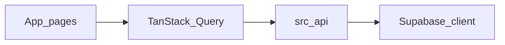

# AGENTS.md — Noticount 代码库指南

面向在本仓库中工作的 AI 助手与贡献者。约定以 **ESLint 配置** 与 **现有代码** 为准；本文件概括架构与习惯，避免与 [eslint.config.mjs](eslint.config.mjs) 冲突。

## 项目简介

**Noticount** 是一个自托管、**多币种**的前端记账应用（见 [README.md](README.md)）。技术栈概览：

- **Next.js**（App Router，`next dev --turbopack`）
- **React**、**TypeScript**
- **Tailwind CSS**、**shadcn/ui**（Radix 等，位于 `components/ui/`）
- **Supabase**（认证与 Postgres 数据）
- **TanStack Query**（服务端状态与缓存）
- **Zod**、**@t3-oss/env-nextjs**（环境变量校验）

包管理器：**pnpm**（`package.json` 中对 `@types/react` / `@types/react-dom` 有 `pnpm.overrides`）。

## 常用命令

| 命令            | 说明                          |
| --------------- | ----------------------------- |
| `pnpm dev`      | 本地开发（Turbopack）         |
| `pnpm build`    | 生产构建                      |
| `pnpm start`    | 启动生产服务                  |
| `pnpm lint`     | ESLint 检查（含格式相关规则） |
| `pnpm lint:fix` | 自动修复可修复项              |

本仓库**没有**单独的 Prettier 配置；**lint 与格式化**由 **ESLint**（`@antfu/eslint-config` + `formatters: true` + `eslint-plugin-format`）统一处理。若风格与文档表述不一致，以 `pnpm lint` 为准。

## 代码风格（与 ESLint 对齐）

以下与 [eslint.config.mjs](eslint.config.mjs) 一致，编写新代码时应遵守：

- **对象类型**：使用 `type`，不要用 `interface`（`ts/consistent-type-definitions`）。
- **尾随逗号**：**不使用**（`trailingComma: "never"`）。
- **缩进**：2 空格；**字符串**：双引号；**语句**：使用分号。
- **文件名**：`kebab-case`（`unicorn/filename-case`）；`README.md`、`AGENTS.md` 为例外。
- **`process.env`**：在 **TS/TSX** 中禁止直接访问（`node/no-process-env`）。唯一例外是 **[`src/env.js`](src/env.js)**，该文件内关闭此规则，用于集中定义并校验环境变量。
- 其他：`no-console` 为 **warn**；`perfectionist/sort-imports` 与 `sort-exports` 为 **warn**。

运行 `pnpm lint` 或 `pnpm lint:fix` 后再提交。

## 导入与路径

- **路径别名**：`@/*` 映射到仓库根目录（见 [tsconfig.json](tsconfig.json)）。优先使用 `@/components/...`、`@/lib/...`、`@/src/...`，与现有文件一致。
- **同目录类型/模块**：可使用相对路径（如 `lib/supabase.ts` 中 `./supabase.type`）。
- **不要求**在导入路径中写 `.ts` / `.tsx` 扩展名（与当前 Next/TS 习惯一致）。

## 目录约定

** 更新文件时请务必更新本段落 **

```
src/app/                 # App Router：页面与布局
  (index)/               # 路由组
    layout.tsx           # QueryClientProvider、AuthCheck、Navbar 等
    signin/page.tsx
    record/              # 记账
      layout.tsx         # 并行槽位：submit、list
      @submit/page.tsx
      @list/page.tsx
  _components/           # 如 auth-check、navbar（非 route segment）
  _context/              # 如 auth-session
src/api/                 # 与 Supabase 的查询/变更封装
src/styles/              # 全局样式
components/ui/           # shadcn 风格 UI 组件
lib/                     # supabase 客户端、utils、supabase.type.ts
```

## 环境变量

- 在应用代码中通过 **`import { env } from "@/src/env"`**（或等价路径）使用已校验的变量，**不要**在业务 TS/TSX 里散落 `process.env`。
- 定义与校验在 **[`src/env.js`](src/env.js)**（`createEnv` + Zod）；服务端与 `NEXT_PUBLIC_*` 客户端变量均在此声明。
- **[`next.config.ts`](next.config.ts)** 中 `import "@/src/env.js"`，在构建时加载环境校验。

## Supabase 与数据

- 浏览器侧客户端：**[`lib/supabase.ts`](lib/supabase.ts)**，使用 **`Database`** 类型（[`lib/supabase.type.ts`](lib/supabase.type.ts)）。
- 核心表 **`account_records`**：字段包括 `amount`、`currency_type`、`record_type`、`note`、`user_id`、`created_at` 等（以类型定义为准）。
- 在 Supabase 控制台为表配置 **RLS**，按用户隔离数据；客户端使用 **anon key** 时权限由策略决定。若日后引入 **service role**，仅用于受信任的服务端环境，**切勿**暴露给浏览器。

## 认证与客户端数据

- **[`src/app/_components/auth-check.tsx`](src/app/_components/auth-check.tsx)**：检查会话，未登录跳转 `/signin`；通过 **`AuthSessionCtx`** 向下传递 session。
- **[`src/app/(index)/signin/page.tsx`](<src/app/(index)/signin/page.tsx>)**：GitHub OAuth 与匿名登录等。
- **[`src/app/(index)/layout.tsx`](<src/app/(index)/layout.tsx>)**：顶层 **`QueryClientProvider`**；列表/提交等页面使用 **`useQuery` / `useMutation` / `useInfiniteQuery`**（见 `src/api/` 与各 `page.tsx`）。

数据流概览：



## 路由说明

- **`/record`** 使用 **并行路由** 槽位 **`@submit`** 与 **`@list`**（见 [`src/app/(index)/record/layout.tsx`](<src/app/(index)/record/layout.tsx>)），同时渲染录入与列表区域。

## Git 与提交

- **simple-git-hooks**：`pre-commit` 运行 **lint-staged**，对暂存文件执行 **`eslint`**。
- 提交前建议本地执行 `pnpm lint`，避免 CI 或钩子失败。

## 测试

当前仓库**未配置**单元测试运行器（如 Vitest/Jest）。若需补充测试，建议与现有 ESLint/TS 工具链对齐另行引入。

## 对 AI 与贡献者的期望

- **小范围修改**：只改任务所需文件；避免无关重构与「顺手整理」。
- **风格一致**：与现有组件、API 层写法保持一致；不确定时以本文件 + `eslint.config.mjs` + 邻近文件为准。
- **性能与 UX**：列表等已用 TanStack Query 时注意缓存失效与加载状态；敏感信息勿写入日志或客户端。

---

本文件随仓库演进可更新；若与 ESLint 或 `package.json` 脚本矛盾，以配置与脚本为准。
