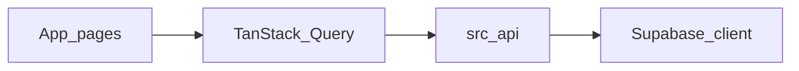

# AGENTS.md — Noticount 代码库指南

给仓库内 AI 助手和贡献者。以 **ESLint 配置** + **现有代码** 为准；本文档讲架构和习惯，避免和 [eslint.config.mjs](eslint.config.mjs) 打架。

## 项目简介

**Noticount**：自托管、**多币种**前端记账（见 [README.md](README.md)）。技术栈：

- **Next.js**（App Router，`next dev --turbopack`）
- **React**、**TypeScript**
- **Tailwind CSS**、**shadcn/ui**（Radix 等，位于 `components/ui/`）
- **Supabase**（认证 + Postgres）
- **TanStack Query**（服务端状态 + 缓存）
- **Zod**、**@t3-oss/env-nextjs**（环境变量校验）

包管理器：**pnpm**（`package.json` 里给 `@types/react` / `@types/react-dom` 配了 `pnpm.overrides`）。

## 常用命令

| 命令            | 说明                 |
| --------------- | -------------------- |
| `pnpm dev`      | 本地开发（Turbopack） |
| `pnpm build`    | 生产构建             |
| `pnpm start`    | 启动生产服务         |
| `pnpm lint`     | ESLint 检查 + 格式规则 |
| `pnpm lint:fix` | 自动修复可修项       |
| `pnpm test`     | Vitest 单元测试      |
| `pnpm supabase:type` | 生成 Supabase 类型定义 |

仓库无独立 Prettier。格式化交给 **ESLint**（`@antfu/eslint-config` + `formatters: true` + `eslint-plugin-format`）。文档和风格冲突时，听 `pnpm lint`。

## 代码风格（与 ESLint 对齐）

写新代码按 [eslint.config.mjs](eslint.config.mjs)：

- **对象类型**：用 `type`，不用 `interface`（`ts/consistent-type-definitions`）。
- **尾随逗号**：**不用**（`trailingComma: "never"`）。
- **缩进**：2 空格；**字符串**：双引号；**语句**：分号。
- **文件名**：`kebab-case`（`unicorn/filename-case`）；`README.md`、`AGENTS.md` 例外。
- **`process.env`**：TS/TSX 禁止直接读（`node/no-process-env`）。唯一例外 **[`src/env.js`](src/env.js)**：集中定义 + 校验环境变量。
- 其他：`no-console` 是 **warn**；`perfectionist/sort-imports`、`sort-exports` 是 **warn**。

提交前跑 `pnpm lint` 或 `pnpm lint:fix`。

## 导入与路径

- **路径别名**：`@/*` 指向仓库根目录（见 [tsconfig.json](tsconfig.json)）。优先 `@/components/...`、`@/lib/...`、`@/src/...`，跟现有代码一致。
- **同目录类型/模块**：可用相对路径（例：`lib/supabase.ts` 里的 `./supabase.type`）。
- **不要求**导入路径写 `.ts` / `.tsx` 扩展名（按当前 Next/TS 习惯）。

## 目录约定

** 更新文件时务必同步本段 **

```
src/app/                 # App Router：页面与布局
  (index)/               # 路由组
    layout.tsx           # QueryClientProvider、AuthCheck、Navbar 等
    signin/page.tsx
    record/              # 记账
      layout.tsx         # 并行槽位：submit、usage、list
      @submit/page.tsx
      @usage/page.tsx
      @list/page.tsx
  _components/           # 如 auth-check、navbar、set-budget-trigger、progress-bar（非 route segment）
  _context/              # 如 auth-session
src/api/                 # 与 Supabase 的查询/变更封装（如 usage、user-budget-settings、monthly-settlements）
src/styles/              # 全局样式
components/ui/           # shadcn 风格 UI 组件（含 drawer）
lib/                     # supabase 客户端、utils、supabase.type.ts
```

## 环境变量

- 业务代码用 **`import { env } from "@/src/env"`**（或等价路径）取已校验变量；不要在 TS/TSX 到处写 `process.env`。
- 定义 + 校验在 **[`src/env.js`](src/env.js)**（`createEnv` + Zod）；服务端变量和 `NEXT_PUBLIC_*` 客户端变量都在这声明。
- **[`next.config.ts`](next.config.ts)** 里 `import "@/src/env.js"`，构建阶段就校验环境变量。

## Supabase 与数据

- 浏览器客户端：**[`lib/supabase.ts`](lib/supabase.ts)**，用 **`Database`** 类型（[`lib/supabase.type.ts`](lib/supabase.type.ts)）。
- 核心表 **`account_records`**：含 `amount`、`currency_type`、`record_type`、`note`、`user_id`、`created_at` 等（以类型定义为准）。
- 在 Supabase 控制台配 **RLS**，按用户隔离。客户端用 **anon key** 时权限受策略控制。若后续引入 **service role**，只放可信服务端，**不要**暴露浏览器。
- `src/api/` 的查询/变更函数经 [`src/api/session-user.ts`](src/api/session-user.ts) 的 `requireSessionUserId()` 从当前会话派生 uid 后做过滤/盖章。**页面/组件不得传 `userId`**；仅 `src/api/` 内部允许把刚由 `requireSessionUserId()` 取得的 uid 传给同层函数（可选参数），以保证单次操作内 uid 一致。

## 认证与客户端数据

- **[`src/app/_components/auth-check.tsx`](src/app/_components/auth-check.tsx)**：检查 session，未登录跳 `/signin`；通过 **`AuthSessionCtx`** 向下传。
- **[`src/app/(index)/signin/page.tsx`](<src/app/(index)/signin/page.tsx>)**：GitHub OAuth、匿名登录等。
- **[`src/app/(index)/layout.tsx`](<src/app/(index)/layout.tsx>)**：顶层 **`QueryClientProvider`**；列表/提交等页面用 **`useQuery` / `useMutation` / `useInfiniteQuery`**（见 `src/api/` 和各 `page.tsx`）。

数据流概览：



## 路由说明

- **`/record`** 用并行路由槽位 **`@submit`**、**`@usage`**、**`@list`**（见 [`src/app/(index)/record/layout.tsx`](<src/app/(index)/record/layout.tsx>)），同屏渲染录入、统计、列表。

## 通用领域概念

- **`account_record`**：用户创建的单条记账记录，字段见 `lib/supabase.type.ts` 中的 `account_records` 表。关键字段：
  - `currency_type`：币种，业务上目前为 `CNY`、`GBP`、`USD`、`EUR`、`JPY`。
  - `record_type`：记录分类，仅 `daily`（日常）或 `special`（非日常）。
- **`/record/@list` 中的 Day Summary Badge**：每日记录分组头部显示的汇总徽标，表示某币种 × 某记录类型的合计金额。规则：
  - 只显示实际存在记录的组合。
  - `daily` 用蓝色系，`special` 用紫色系。
  - 排序：先按币种 `CNY → GBP → USD → EUR → JPY`，同一币种下 `daily` 在前、`special` 在后。
  - 金额始终保留两位小数，并附带对应币种符号。
- **跨月结转（carryover）**：预算结余逐月累计（超支记负结余，同样累计），永不失效。采用**惰性结算**：
  - `monthly_budget_settlements` 表存储已结算月份（每行 = 某币种某月的 `budget_amount` / `spend_amount`，不存累计值，累计在代码中求和）。
  - `getUsageSummary`（`src/api/usage.ts`）执行时检测未结算的历史月份，计算并 upsert 写入（`(user_id, currency_type, month_key)` 唯一约束 + `ignoreDuplicates` 保证幂等），无 cron、无 RPC。
  - **宽限期**：`GRACE_MONTHS = 1`，只有上上月及更早的月份才归档结算；**上个月**和**本月**始终按明细实时计算。
  - 某月结算预算 = 该月有效预算（`time_to_effect <= 该月` 中 `time_to_effect` 最大、`id` 最大的一条）。
  - 月份归属按浏览器本地时区分桶，与 `YYYYMM` month key 口径一致；月份键工具为 `addMonthsKey`。
  - UI 不单独展示结余；进度条分母为 `totalAvailable = 本月预算 + 累计结余`，`usagePercent` 基于 `totalAvailable` 计算。
- **进度条时间进度标记**：`/record/@usage` 的进度条由 [`src/app/_components/progress-bar.tsx`](src/app/_components/progress-bar.tsx) 的 `ProgressBar` 渲染，可选参数 `markerPercent` 在对应百分比位置渲染一条竖线标记（不传则不渲染）。标记与进度条等高，两侧用 `mask-image` 渐变把轨道/填充抠出透明小缺口（不依赖表面色），线色统一为 `green-600`。注意本项目的深浅色主题靠 `prefers-color-scheme` 媒体查询驱动，没有 `.dark` 类，因此 class 式的 `dark:` 变体不生效。@usage 传入的是 `UsageSummary.monthElapsedPercent`（[`src/api/usage.ts`](src/api/usage.ts) 的 `getMonthElapsedPercent`）：今天（含）是当月第几天 / 当月总天数，浏览器本地时区，用于对比消费进度与时间进度。

## Git 与提交

- **simple-git-hooks**：`pre-commit` 跑 **lint-staged**，对暂存文件执行 **`eslint`**。
- 提交前本地跑 `pnpm lint`，少踩 CI / hook 失败。

## 测试

测试运行器为 **Vitest**（`vitest.config.mts`，配了 `@/` 别名并通过 `process.loadEnvFile()` 加载 `.env`）。单测放在被测模块旁（如 `src/api/usage.test.ts`），优先覆盖纯函数。运行：`pnpm test`。

### 冒烟测试

每次改完代码后，至少跑一次 `pnpm build`，确认 `next build` 整个类型检查 + 构建链路通过。`pnpm lint` 只查 ESLint 规则，不会跑 TS 全量类型检查；构建会跑，错误会一起暴露。

## 对 AI 与贡献者的期望

- **小范围修改**：只改任务相关文件；别做无关重构和「顺手整理」。
- **风格一致**：跟现有组件、API 层写法保持一致；不确定就看本文件 + `eslint.config.mjs` + 邻近代码。
- **性能与 UX**：用 TanStack Query 的列表注意缓存失效和加载状态；敏感信息别写日志或客户端。

---

文档会随仓库演进更新；若和 ESLint 或 `package.json` 脚本冲突，以配置和脚本为准。
